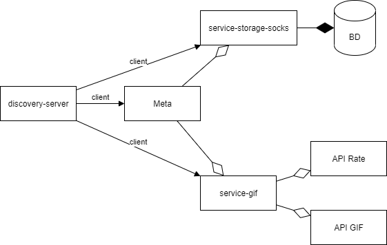

# Meta
Веб приложение на основе микросервисной архитектуре  
Патерн - Агрегатор  
Подключен Eureka Server 

  
  
Сервис meta позволяет работать с двумя сервисами:
1) service-storage-socks - предоставляет возможность автоматизации учёта носков на складе магазина. Имеет такие функции:  
* добавить/убрать носки на склад 
* узнать общее количество носков определенного цвета и состава в данный момент времени  

2) service-gif - позволяет получить gif-изображение определённого типа, работает по таким правилам:  
* 1) обращается к сервису курса валют, получает курс рубля к доллару за текущий и прошлый день   
* 2) В зависимости от разницы (>= 0 || < 0) обращается к сервису gif-изображений и возвращает gif нужного нам типа (rich || broke)

